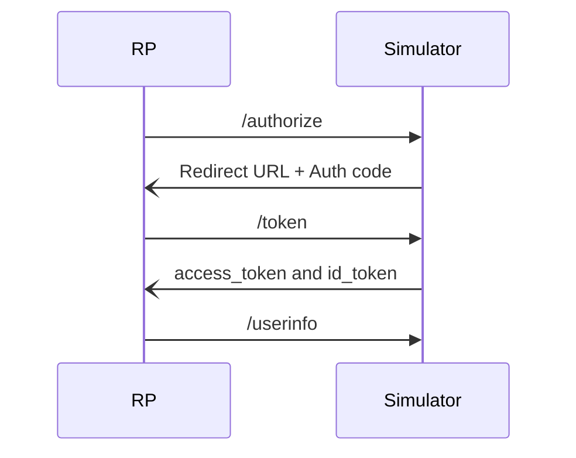

# GOV.UK One Login Simulator

## Using the simulator:

The GOV.UK One Login simulator is a development tool that lets you run end-to-end tests, so you can:

- test and verify specific user information such as names and email addresses
- request specific error codes and learn more about what they mean in a test environment
- test integrations with GOV.UK One Login without going through account creation

The simulator runs locally on your machine, or can be deployed. The simulator is distributed as a Docker image and is deployed via GitHub. The GOV.UK One Login team runs nightly acceptance tests against the live system, so you’ll always be testing with the most up-to-date version of GOV.UK One Login.

The simulator stands in as GOV.UK One Login in acting as the [OpenID Provider (OP)](https://openid.net/specs/openid-connect-core-1_0.html#:~:text=%C2%A0TOC-,1.3.%C2%A0%20Overview,-The%20OpenID%20Connect) for Relying Parties (RP) to test their integration.

The simulator provides similar testing functionality as building mocks but without the need for you to build anything yourself. This means the simulator is a quicker and easier way of testing your setup. The simulator also lets you use your own test data, meaning you can test a wider range of scenarios.

### RP Requirements to use the Simulator:

The simulator aims to mirror GOV.UK One Login but does not support all of the features, therefore there are some limitations to what RP features it supports:

- You **must** use the[`private_key_jwt` authentication method](https://openid.net/specs/openid-connect-core-1_0.html#:~:text=OAuth.JWT%5D.-,private_key_jwt,-Clients%20that%20have) at the `/token` endpoint
- You **must** attach a `nonce` parameter in the `/authorize` request
- You **must** use a `GET` request with either query parameters or a [request object](https://openid.net/specs/openid-connect-core-1_0.html#:~:text=%C2%A0TOC-,3.1.2.1.%C2%A0%20Authentication%20Request,-An%20Authentication%20Request) when making a request to `/authorize`. The simulator does not support the `POST` method for authorization requests.

## Documentation:

- [Setting up configuration](./docs/configuration.md)
- [Configuring Errors](./docs/configured-errors.md)
- [Default configuration values](./docs/default-config-values.md)
- [Running the simulator in interactive mode](./docs/interactive-mode.md)

## Developing on the Simulator
Developer instructions can be found in [CONTRIBUTING.md](./CONTRIBUTING.md)